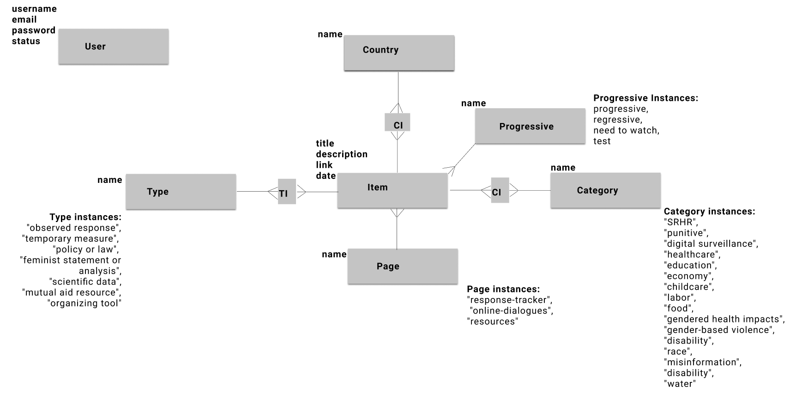

## Feminist Covid-19 Response -- API

***
## Table of contents
- [Getting Started](#getting-started)
    - [Node Installation on OS X](#node-installation-on-os-x)
    - [Node Installation on Linux](#node-installation-on-linux)
    - [Node Installation on Windows](#node-installation-on-windows)
- [Installation](#installation)
- [Start and Watch](#start-and-watch)
- [Domain Model](#domain-model)
- [Seed data](#seed-data)
- [Endpoints and Sample Responses](#endpoints-and-sample-responses)
    - [items](#items)
    - [specific page](#specific-page)
    - [pages](#pages)
    - [specific category](#specific-category)
- [Languages and tools](#languages-and-tools)
- [Contributing](#contributing)
    - [Known Issues](#known-issues)
- [License](#license)

## Getting Started
For development, you will only need Ruby on Rails and Postgres, which depends on Homebrew and Ruby. 

#### Node installation on OS X

You will need to use a Terminal. On OS X, you can find the default terminal in
`/Applications/Utilities/Terminal.app`.

1. Install [Homebrew](http://brew.sh/):

    ```
    $ ruby -e "$(curl -fsSL https://raw.githubusercontent.com/Homebrew/install/master/install)"
    ```

2. Install [Ruby](https://www.ruby-lang.org/en/):
```
    $ brew install rbenv ruby-build
    # Add rbenv to bash so that it loads every time you open a terminal
    $ echo 'if which rbenv > /dev/null; then eval "$(rbenv init -)"; fi' >> ~/.bash_profile
    $ source ~/.bash_profile

    # Install Ruby
    $ rbenv install 2.7.1
    $ rbenv global 2.7.1
    $ ruby -v
```
3. Install [Rails](https://rubyonrails.org/)
```
    $ gem install rails -v 6.0.2.2
```

4. Install [PostgreSQL](https://www.postgresql.org/)
```
    $ brew install postgresql
```

#### Node installation on Linux

Go on [official Rails website](https://gorails.com/setup/ubuntu/19.10) & follow the steps.

#### Node installation on Windows

Go on [official Rails website](https://gorails.com/setup/windows/10) & follow the steps.

## Installation

1. Clone the repo and cd into the folder:
```
    $ git clone https://github.com/wedo-org/feministcovidresponse-backend.git
    $ cd backend-lets-change-the-subject
```
2. Install dependencies (gems)
```
    $ bundle
```
3. Create migrations, migrate and seed:
```
    $ rails db:create
    $ rails db:migrate
    $ rails db:seed
```

## Start and Watch

```
    $ rails s
```
***
## Domain model


**please note**: 
- what previously was called "categories" now is called `pages`; there are three pages and their names correspond to the front-end routes (e.g. `online-dialogues`);
- what previously was called "themes" now is called `categories`.

**gotchas**: 
1. for the sake of simplicity, the `date` attribute is a string, as is the corresponding key in the serialized response (which is called `eventDate`). It follows the format of: "m/yyyy", for instance: "4/2020". In case there is no month or year, it is replaced with 'm' or 'yyyy', e.g.:
- no month: 'm/2020'
- no year: '4/yyyy'
2. Currently, each entry needs to have a relationship with an instance of `Progressive` class. Since that is not the case with the data (only "response-tracker" data items have a corresponding `Progressive`), the data items that are not supposed to have `progressive` attribute, have one with the value of `test`. This will be fixed in the future.

## Seed data
The extensive seed data (e.g. covering all countries) may take a moment. There are bread crumbs (`puts`) left along the way after each of the seeding phase so you know that there is a progress.

## Endpoints and sample responses

This app follows RESTful routes and uses API versioning. Currently, the calls can be made to `/api/v1/`. Below you will find available endpoints with sample responses. If any field is empty, instead of an empty array or strings, it will default to null.

### Items

**Endpoint**: GET `/api/v1/items`

**Response description**: Response provides all the items without separating them into pages. For this kind of response, see [pages](#pages) or [specific page](#specific-page).
 
**Sample response**:
```
// http://localhost:3000/api/v1/items/

[
    {
    "title_en": "Support to women fleeing gender-based violence",
    "title_es": "Apoyo a las mujeres que huyen de la violencia de género",
    "title_fr": "Aide aux femmes fuyant la violence sexiste",
    "description_en": "Canada will give $40 million to Women and Gender Equality Canada (WAGE), up to $30 million of which will address immediate needs of shelters and sexual assault centres.",
    "link": "https://www.canada.ca/en/employment-social-development/news/2020/04/canada-announces-support-to-those-experiencing-homelessness-and-women-fleeing-gender-based-violence-during-the-coronavirus-disease-covid-19-pandemic.html",
    "types": [
      "temporary measure"
    ],
    "progressive": "progressive",
    "eventDate": null,
    "page": "response-tracker",
    "countries": [
      "Canada"
    ],
    "description_es": "Canadá otorgará $ 40 millones a Mujeres e Igualdad de Género de Canadá (WAGE), de los cuales hasta $ 30 millones cubrirán las necesidades inmediatas de refugios y centros de agresión sexual",
    "description_fr": "Le Canada accordera 40 millions de dollars à Women and Gender Equality Canada (WAGE), dont jusqu'à 30 millions de dollars répondront aux besoins immédiats des refuges et des centres d'agression sexuelle."
  },
]
```

### Pages 
**Endpoint**: GET `/api/v1/pages`

**Action description**: Response will consist of all pages with their associated items.

**Sample response**:
```
// http://localhost:3000/api/v1/pages/

[
  {
    "name": "response-tracker",
    "items": [
          {
      "title_en": "COVID-19 And Men",
      "title_es": "COVID-19 y hombres",
      "title_fr": "COVID-19 And Men",
      "description_en": "Webinar on how men are more affected by COVID-19 in terms of higher death rates. ",
      "link": "https://shop.menshealthforum.org.uk/products/webinar-men-covid-19-april-20-2020-2pm?_ga=2.146902195.506116164.1587597573-367827357.1587597573",
      "types": null,
      "progressive": "test",
      "eventDate": "m/2020",
      "page": "online-dialogues",
      "countries": [
        "United Kingdom"
      ],
      "description_es": "Seminario web sobre cómo los hombres se ven más afectados por COVID-19 en términos de tasas de mortalidad más altas",
      "description_fr": "Webinaire sur la façon dont les hommes sont davantage touchés par COVID-19 en termes de taux de mortalité plus élevés."
    },
    ]
  },
  {
    "name": "resources",
    "items": [
      
    ]
  }
]
```

### Specific page 
**Endpoint**: GET `/api/v1/pages/response-tracker` or `/api/v1/pages/resources` or `/api/v1/pages/online-dialogues`

**Action description**: Response will consist of a given page with associated items.

**Sample response**:
```
// http://localhost:3000/api/v1/pages/response-tracker

{
  "name": "response-tracker",
  "available_categories": [
    "SRHR",
    "childcare",
    "digital surveillance",
  ],
  "available_countries": [
    "Algeria",
    "Anglophone Africa",
  ],
  "items": [
    {
      "title_en": "COVID-19 And Men",
      "title_es": "COVID-19 y hombres",
      "title_fr": "COVID-19 And Men",
      "description_en": "Webinar on how men are more affected by COVID-19 in terms of higher death rates. ",
      "link": "https://shop.menshealthforum.org.uk/products/webinar-men-covid-19-april-20-2020-2pm?_ga=2.146902195.506116164.1587597573-367827357.1587597573",
      "types": null,
      "progressive": "test",
      "eventDate": "m/2020",
      "page": "online-dialogues",
      "countries": [
        "United Kingdom"
      ],
      "description_es": "Seminario web sobre cómo los hombres se ven más afectados por COVID-19 en términos de tasas de mortalidad más altas",
      "description_fr": "Webinaire sur la façon dont les hommes sont davantage touchés par COVID-19 en termes de taux de mortalité plus élevés."
    },
  ]
}
```

### Specific category
**Endpoint**: GET `/api/v1/categories/#{name of the category}`
**Action description**: Response will contain 50 random questions from the given category.
**Sample response**:
```
tba
```

## Languages and Tools

- [Ruby on Rails](https://rubyonrails.org/) 
- [PostgreSQL](https://www.postgresql.org/) - database
- [Active Record](https://guides.rubyonrails.org/active_record_basics.html) - Object Relational Mapping system
- [Active Model Serializers](https://github.com/rails-api/active_model_serializers) - serialization

## Contributing
Pull requests are welcome. Please make sure that your PR is [well-scoped](https://www.netlify.com/blog/2020/03/31/how-to-scope-down-prs/).
For major changes, please open an issue first to discuss what you would like to change. 

### Known issues
Visit [issues](https://github.com/luanesouza/backend-lets-change-the-subject/issues) section.

### Contributors
tba


## License
[MIT](https://choosealicense.com/licenses/mit/)
